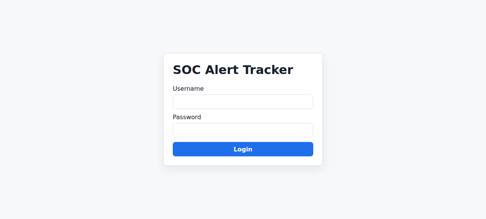
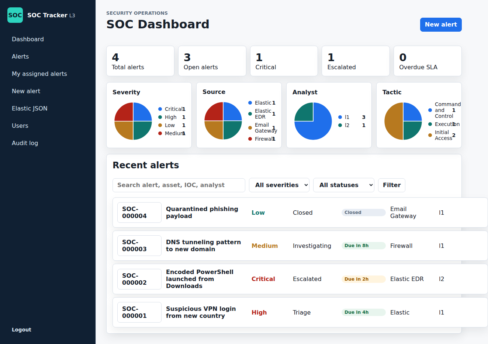
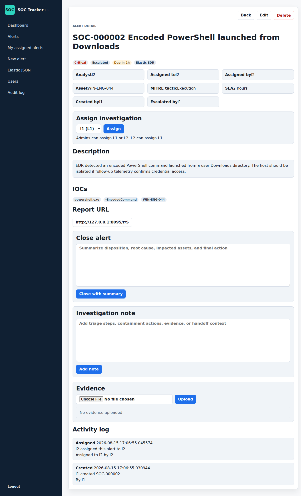
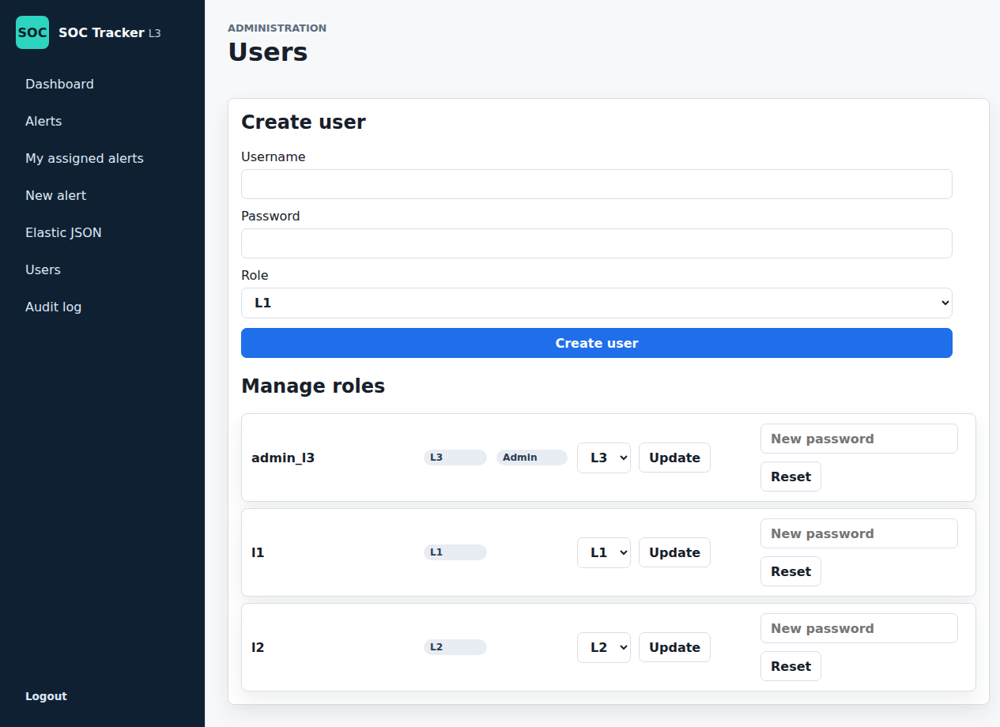

# SOC Alert Tracker


A lightweight, self-hosted security operations alert tracker built with FastAPI. Designed for SOC teams that need role-based alert management, Elastic SIEM integration, and n8n workflow automation — without vendor lock-in.

## Quick start (Docker)

```bash
git clone https://github.com/ethanx01-H/SOC-Tracker.git
cd SOC-Tracker
cp .env.example .env
# Edit .env — set N8N_API_KEY and APP_SECRET_KEY
docker compose up --build
```

Open `http://localhost:8080` and log in with the demo accounts below.

## Demo users

Created automatically on first startup:

| Username   | Role         | Password      |
|------------|--------------|---------------|
| `l1`       | L1 Analyst   | `password123` |
| `l2`       | L2 Analyst   | `password123` |
| `admin_l3` | L3 Admin     | `password123` |

## Screenshots

### Login



### Dashboard

SOC dashboard with alert counts, pie charts, and filtered alert queue.



### Alert detail

Full alert view with assignment, IOCs, investigation notes, evidence uploads, and activity log.



### User administration

Create users, manage roles (L1/L2/L3), and reset passwords.



## Features

### Alert management
- SOC dashboard with severity/source/analyst/tactic pie charts and alert counts
- Create, edit, escalate, assign, and close alerts with resolution summaries
- Six-digit alert IDs (`SOC-000001`) with full-page detail links for reports
- Filter by severity, status, search terms; CSV export of filtered results
- Evidence file uploads with SHA-256 integrity tracking
- Investigation notes and activity-log timeline per alert

### Role-based access control

| Capability         | L1 Analyst | L2 Analyst | L3 Admin |
|--------------------|:----------:|:----------:|:--------:|
| View alerts        | Yes        | Yes        | Yes      |
| Create alerts      | Yes        | Yes        | Yes      |
| Edit alerts        | Yes*       | Yes        | Yes      |
| Escalate alerts    | Yes        | Yes        | Yes      |
| Assign to analysts | No         | L1 only    | L1 + L2  |
| Delete alerts      | No         | No         | Yes      |
| Manage users       | No         | No         | Yes      |

*L1 cannot edit alerts after they are escalated.

### Elastic JSON import

Paste raw Elastic alert JSON directly into the tracker. Supported shapes:

- Raw Elastic hits with `_source`
- `hits.hits` search responses
- Plain JSON objects with ECS or Kibana alert fields

The parser extracts title, description, source, severity, asset, MITRE tactic, and IOCs automatically.

### n8n webhook integration

Push alerts from n8n workflows:

```bash
curl -X POST http://localhost:8080/api/webhook/n8n/ \
  -H "X-API-Key: <your-key>" \
  -H "Content-Type: application/json" \
  -d '{"title":"Brute force detected","severity":"High","source":"n8n"}'
```

Push enrichment logs into an existing alert:

```bash
curl -X POST http://localhost:8080/api/webhook/n8n/logs/ \
  -H "X-API-Key: <your-key>" \
  -H "Content-Type: application/json" \
  -d '{"alert_id":"SOC-000001","message":"GeoIP lookup completed.","workflow":"SOC enrichment"}'
```

### Report links

Share direct links to individual alerts in weekly or monthly reports:

```
http://localhost:8080/r/SOC-000001/
```

## Security

Tested against OWASP Top 10 (2021). All categories pass.

| OWASP Category                  | Status | Controls                                                  |
|---------------------------------|--------|-----------------------------------------------------------|
| A01 Broken Access Control       | Pass   | Auth required on all routes, RBAC on every action         |
| A02 Cryptographic Failures      | Pass   | PBKDF2-SHA256 (240k iterations), timing-safe comparisons  |
| A03 Injection                   | Pass   | SQLAlchemy ORM, Jinja2 auto-escaping, no command exec     |
| A04 Insecure Design             | Pass   | Login lockout (5 failures / 5 min), password policy       |
| A05 Security Misconfiguration   | Pass   | CSP, X-Frame-Options, HSTS, nosniff, Referrer-Policy     |
| A06 Vulnerable Components       | Pass   | Current dependency versions with version ranges           |
| A07 Auth Failures               | Pass   | 8h session expiry, failed login audit, lockout            |
| A08 Integrity Failures          | Pass   | CSRF on all form endpoints, file upload validation        |
| A09 Logging & Monitoring        | Pass   | Audit log for create/edit/assign/close/delete/auth events |
| A10 SSRF                        | Pass   | No outbound request features                              |

### Security headers

All responses include:

```
X-Content-Type-Options: nosniff
X-Frame-Options: DENY
Referrer-Policy: strict-origin-when-cross-origin
Permissions-Policy: camera=(), microphone=(), geolocation=()
Content-Security-Policy: default-src 'self'; style-src 'self' 'unsafe-inline'; ...
Strict-Transport-Security: max-age=31536000 (when COOKIE_SECURE=1)
```

## Configuration

All settings are controlled via environment variables. See `.env.example` for the full list.

| Variable                 | Required | Default                | Description                              |
|--------------------------|----------|------------------------|------------------------------------------|
| `N8N_API_KEY`            | Yes*     | auto-generated         | Shared secret for n8n webhook API        |
| `APP_SECRET_KEY`         | Yes*     | auto-generated         | Cookie signing key (must persist)        |
| `SQLITE_PATH`            | No       | `data/fastapi.sqlite3` | SQLite database path                     |
| `COOKIE_SECURE`          | No       | `0`                    | Set to `1` for HTTPS-only cookies        |
| `RATE_LIMIT_REQUESTS`    | No       | `120`                  | Max requests per window                  |
| `RATE_LIMIT_WINDOW`      | No       | `60`                   | Rate limit window in seconds             |
| `LOGIN_LOCKOUT_THRESHOLD`| No       | `5`                    | Failed login attempts before lockout     |
| `LOGIN_LOCKOUT_SECONDS`  | No       | `300`                  | Lockout duration in seconds              |

*Auto-generated if not set, but you should set explicit values for production and Docker Compose.

## Development

For local development without Docker:

```bash
python3 -m venv .venv
source .venv/bin/activate
pip install -r requirements.txt
cp .env.example .env
uvicorn main:app --reload --port 8080
```

The `--reload` flag auto-restarts on code changes. Do not use `--reload` in production.

## Project structure

```text
main.py                         FastAPI app (routes, models, auth, middleware)
alerts/
  __init__.py
  elastic.py                    Elastic/Kibana JSON parser
templates/                      Jinja2 HTML templates
  base.html                     Layout with sidebar navigation
  alerts/                       Dashboard, list, detail, form, import
  admin/                        User management, audit log
  registration/                 Login page
static/alerts/app.css           Stylesheet (light/dark theme)
alembic/
  env.py                        Migration configuration
  versions/                     Database migrations
data/                           Runtime SQLite database (gitignored)
Dockerfile                      Production container (gunicorn + uvicorn)
docker-compose.yml              One-command deployment
```

## Tech stack

- **Backend:** FastAPI + SQLAlchemy + Alembic (SQLite)
- **Frontend:** Jinja2 server-rendered HTML, vanilla CSS (light/dark)
- **Auth:** Cookie-based sessions with PBKDF2-SHA256 password hashing
- **Security:** CSRF protection, rate limiting, login lockout, security headers, audit logging
- **Deployment:** Docker with gunicorn + uvicorn workers

## Future improvements

- Automated tests for alert workflows, role permissions, imports, and webhooks
- Dashboard date-range filters and trend charts for weekly/monthly reporting
- Richer SLA tracking with due dates, owner notifications, and breach history
- Evidence management improvements (file previews, tagging, retention)
- External integrations for SIEM enrichment, ticket export, and notifications
- Deployment docs for HTTPS, reverse proxy, and backups
- API documentation page with example payloads for n8n and Elastic imports

## Contributing

Community contributions are welcome. See [CONTRIBUTING.md](CONTRIBUTING.md) for suggested areas, pull request guidance, and security notes.

## License

[MIT](LICENSE)
